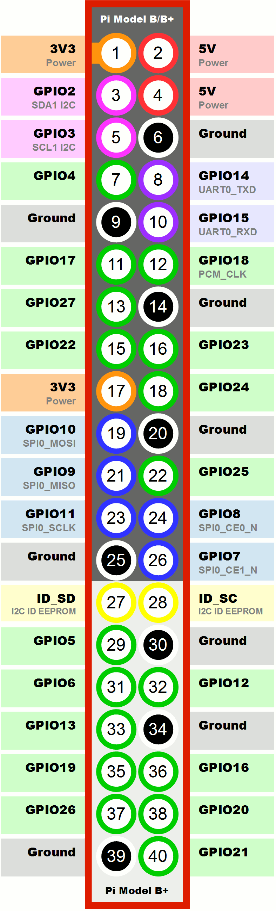
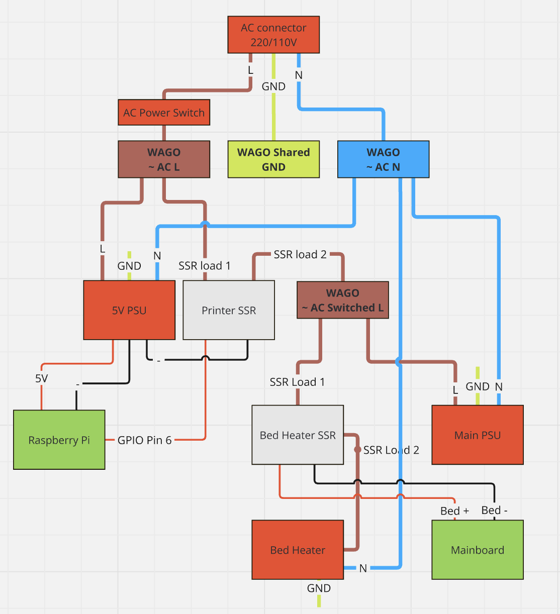

# 3D Printer SSD power switch

This project is a simple power switch for a 3D printer that uses a Raspberry Pi and Mainsail/Fluidd. 
The power switch is controlled by the Raspberry Pi using a GPIO pin.

You can leave your raspberry pi running 24/7 and use the SSR to turn on and off the printer.
The printer will be powered off on any error that halts a print or after an idle timeout.

## !Safety warning!
Keep in mind you're working with AC mains power. 
If you're not comfortable with this, please don't attempt this project.

Make sure to unplug your power when ever you're working in the control box of your printer.

## Hardware
You need an SSR (Solid State Relay) to control the power to the printer. The SSR is connected to the Raspberry Pi using a GPIO pin.
The SSR I used is a Fotek SSR-25DA. It's rated for 25A at 380VAC.

In the configuration below, we're using GPIO Pin 26 on the Raspberry to control the SSR.

Start by hooking up the SSR input side to the Raspberry Pi GPIO pin 26 and GND on your 5V power supply. (or GND on the pi)



## Software prerequisites
If you need help installing Mainsail on your Raspberry Pi, please refer to the [Mainsail documentation](https://docs.mainsail.xyz/setup/installation.html).
I can also recommend using KIAUH (Klipper Installation And Update Helper) https://docs.mainsail.xyz/setup/getting-started/kiauh to install Klipper on your Raspberry Pi.

## Configuration
Configuration is pretty straight forward. Open your moonraker.conf and add the following section to the file.

```
[file_manager]
# post processing for object cancel. Not recommended for low resource SBCs such as a Pi Zero. Default False
enable_object_processing: True

# Configure the file manager to queue uploaded files when the "start" flag
# is set and Klipper cannot immediately start the print.
queue_gcode_uploads: True

# Configure the Job Queue to start a queued print when Klipper reports as
# ready.
[job_queue]
load_on_startup: True
automatic_transition: True

[power printer]
type: gpio
pin: gpiochip0/gpio26
initial_state: off
bound_services: klipper
on_when_job_queued: True
off_when_shutdown: True
```

I have added an idle timeout setting to the klipper configuration like this:
in your printer.cfg add the following lines:

```
[gcode_macro SHUTDOWN_MACHINE]
gcode:
  {action_call_remote_method("set_device_power", device="printer", state="off")}

[idle_timeout]
gcode:
  M84
  TURN_OFF_HEATERS                              # klipper macro to turn off heaters
  TEMPERATURE_WAIT SENSOR=extruder MAXIMUM=40   # Wait for extruder to cool down below 40C
  SHUTDOWN_MACHINE
timeout: 600
```

Save and restart Mainsail. You should now see a new button in the top right corner of the Mainsail interface.

## Testing
Before you change any of the AC wiring, you can now test your configuration. 
When clicking "Power on", the SSR should show a status LED coming up, it might be quite dim because the GPIO pin doesn't provide a lot of current
When clicking "Power off", the SSR should turn off and the status LED should go off.

If your SSR doesnt have a status LED, you can use a multimeter to measure the output of the SSR for continuity between the two output terminals.

## Wiring

A complete wiring diagram of my setup is as follows:
Please note that the wiring diagram is for reference only.
Make sure to double check the wiring before powering up your printer.

Please exuse the poor quality of the diagram. I'm not a graphic designer. :D
